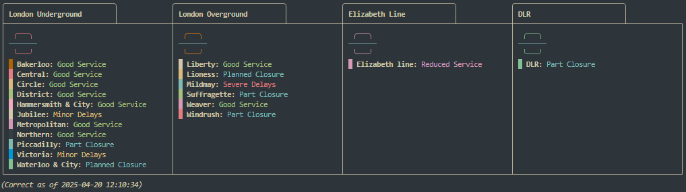

# 🚇 TfL CLI

*A fast and minimal terminal app to check Transport for London (TfL) status and live departures, written in Go.*




## ✨ Features

- 🚦 Live status of TfL lines (Tube, Overground, Elizabeth Line, DLR)
- 🚉 Real-time departures for any TfL station
- ⚙️ Config management to set preferences, such as home and work stations


## 📦 Installation

### Option 1: Download a prebuilt binary

TODO

## 🚀 Usage

### Line status (all lines)

```bash
tfl status
```

### TODO - Line status (single line)


```bash
tfl status victoria
```

### Live departures from a station

```bash
tfl station oxford-circus
```

### Help

```bash
tfl h
tfl help
tfl -h
tfl --help
```


## ⚙️ Configuration

The first time you run the app, a default `.tfl.env` file will be generated.

You will need to configure API credentials here before fetching any data. These can be generated by signing up for a free account on [TfL's API portal](https://api-portal.tfl.gov.uk/).

### Options

| Key                   | Description                                                                                              |
|------------------------|----------------------------------------------------------------------------------------------------------|
| `app_id`              | **(Required)** Your TfL API App ID for increased rate limits.                                               |
| `app_key`             | **(Required)** Your TfL API Key. Used together with `app_id`.                                               |
| `departure_board_width` | Sets the character width for the departure board display. Handy for wide or narrow terminals. |
| `home_station`        | Sets your default "home" station. Use with the `station` command.                                 |
| `work_station`        | Sets your default "work" station. Use with the `station` command.          |


## 🛠️ Built with

- [Go](https://golang.org/)
- [urfave/cli](github.com/urfave/cli/v3) (for CLI)
- [fatih/color](github.com/fatih/color) (for terminal colours)
- [jamesalexatkin/tfl-golang](github.com/jamesalexatkin/tfl-golang) (for transport status)


<!-- ## 🧪 Development

```bash
go build
./tfl status
```

To run tests:

```bash
go test ./...
``` -->


## 🤝 Contributing

Pull requests welcome! If you have ideas or bug reports, feel free to open an issue.


## 📜 License

MIT © 2025 James Atkin


## 🌍 Powered By

Data provided by the [TfL Unified API](https://api.tfl.gov.uk/).  
Please check their terms of use and rate limits.
